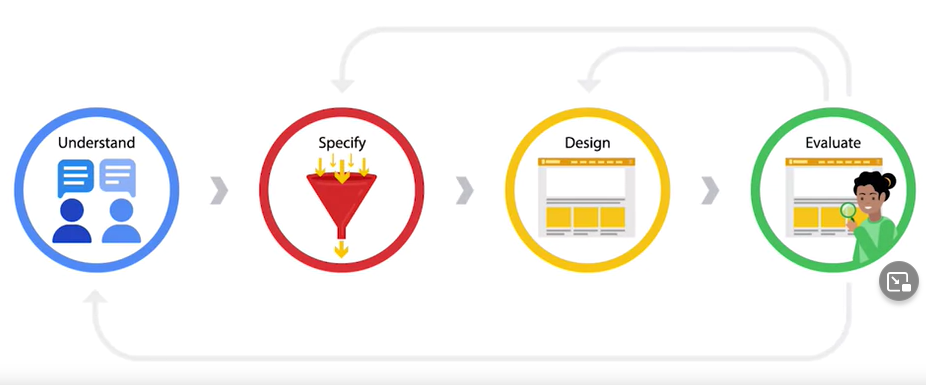
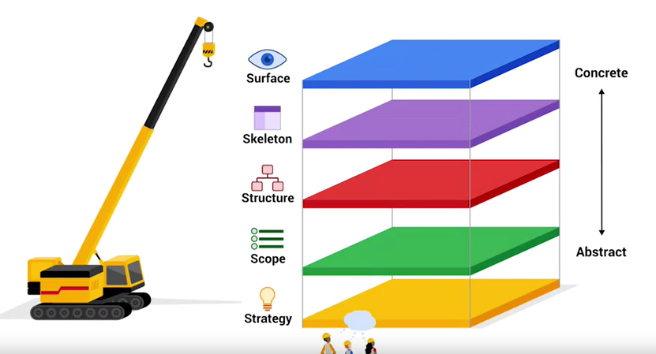

# Curso de UX da Google

Empresas de todos os tipos e tamanhos dependem de designers de experiência do
usuário para tornar a tecnologia delas mais fácil e agradável de usar.

> Ao longo do caminho, você aprenderá com outros funcionários do Google,
os Googlers, cada um com suas próprias perspectivas e histórias únicas. Como os
Googlers criaram este programa, você aprenderá as informações mais práticas
necessárias para iniciar sua própria carreira de design de UX.

## [Lean UX [Neste mesmo curso]](lean_ux/README.MD)

## [Os 4 Cs do Design [Neste mesmo curso]](os_4_C_s_do_design/README.MD)

## [Pesquisa [Neste mesmo curso]](pesquisa/README.MD)

## [Vieses de Pesquisa Importante Ler [Neste mesmo curso]](pesquisa/vies/README.MD)

## [Mapa da Empatia [Neste mesmo curso]](entrevista/README.MD)

## Estrutura

