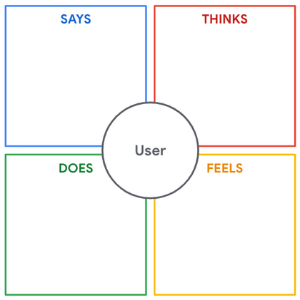

# Entrevistas

## Mapa da empatia

Etapa 1. Adicione o nome do usuário. Insira o nome da pessoa entrevistada no seu mapa de empatia. Colocar o nome nele será útil se você precisar conferir a transcrição original ou a pesquisa, e também vai diferenciar este mapa dos outros mapas que você criou.

Etapa 2. O quadrado “DIZ”. Use citações literais da entrevista. Em outras palavras, escreva exatamente o que a pessoa disse; não o resuma com suas próprias palavras. Se você resumir uma citação, talvez acabe interpretando incorretamente o que o usuário quis dizer. Também é bom tentar captar temas na entrevista que se relacionam com o produto que você está pesquisando. Por exemplo, se o usuário menciona o mesmo problema várias vezes durante a entrevista, provavelmente esse é um grande problema. Preste atenção especial aos desafios que seu usuário afirma e registre quaisquer benefícios desejados ou expectativas que eles mencionem.

Etapa 3. O quadrado “PENSA”. Aqui, você pode resumir os pensamentos expressos pelo usuário. Adicione sentimentos que o usuário transmitiu por meio de linguagem corporal, tom ou outros indicadores perceptíveis, mesmo que eles não os expressem verbalmente para você. Você pode fazer inferências para alguns desses sentimentos, mas tenha cuidado para não fazer suposições sobre o usuário. Por exemplo, Makayla expressou preocupação com o filho adolescente do seu vizinho e mencionou sua idade e qualificações. Uma suposição é que Makayla quer um passeador de cães adulto. Uma inferência é que ela quer um passeador de cães com um carro e uma carteira de motorista que possa levar o cachorro ao veterinário em caso de emergências. Sempre é possível pedir que o usuário esclareça a linguagem corporal dele se você notar alguma contradição.

Etapa 4. O quadrado “FAZ”. Makayla nos deu bastante detalhes sobre os passos e ações que ela realiza para lidar com seus desafios relacionados a passear com cães. Todas essas ações podem ser colocadas no quadrado “FAZ”.

Etapa 5. O quadrado “SENTE”. Liste os sentimentos que expressados pelo usuário. Algumas observações que você inserir talvez sejam iguais ao que você listou no quadrado “PENSA”. Mas não tem problema. O objetivo deste processo é gerar uma documentação completa das suas observações. Se é você quem está realizando entrevista, você pode ter notado sinais de sentimentos como raiva, frustração, animação e outros. Se o usuário não mencionar explicitamente nenhum sentimento durante a entrevista, você pode investigar os sentimentos com a pergunta: “Como você se sente em relação a isso?”

